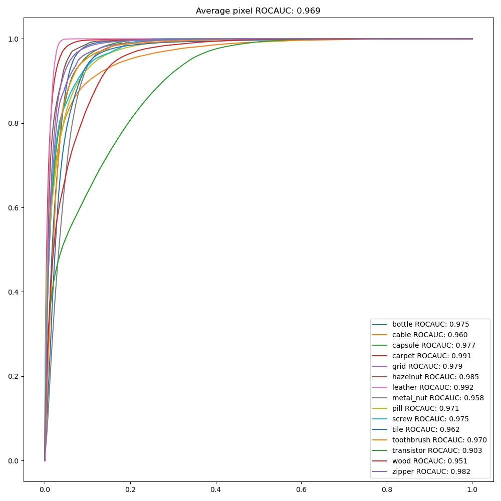
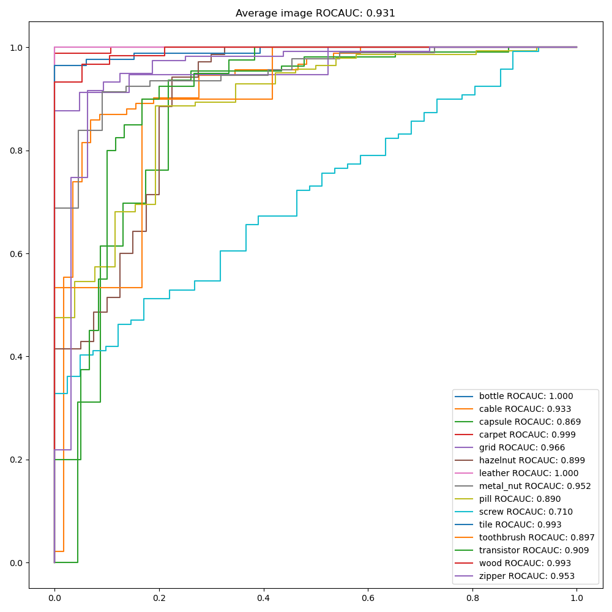
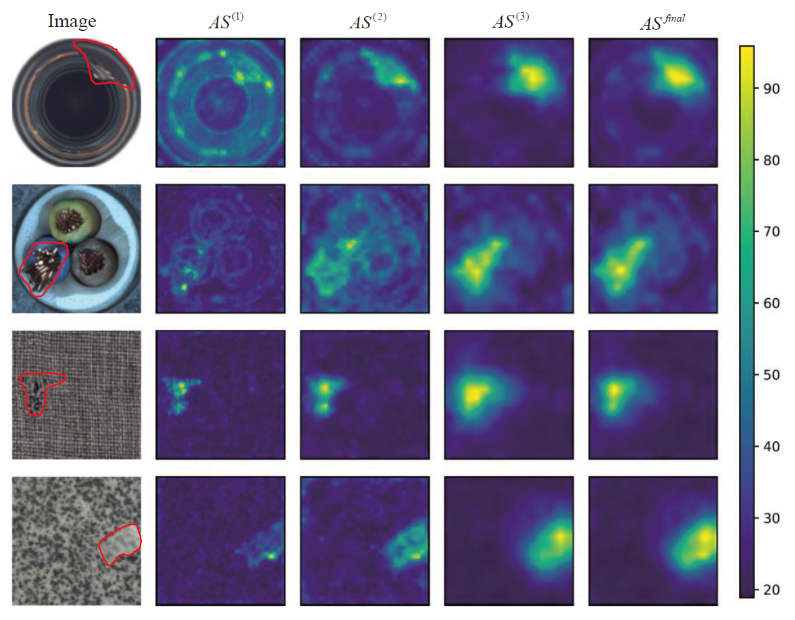

#### [Industrial Image Anomaly Localization Based on Gaussian Clustering of Pre-trained Feature](https://ieeexplore.ieee.org/document/9479740)
 

```python
python dpfc_kmeans_covariance.py --k 10 --backbone wide_resnet50_2 --data_root mvtec_root  
```


 <p align="center">
	
	
</p> 

 <p align="center">
	
</p> 


<p>
Q. Wan, L. Gao, X. Li and L. Wen, "Industrial Image Anomaly Localization Based on Gaussian Clustering of Pre-trained Feature," in IEEE Transactions on Industrial Electronics, doi: 10.1109/TIE.2021.3094452.
</p> 