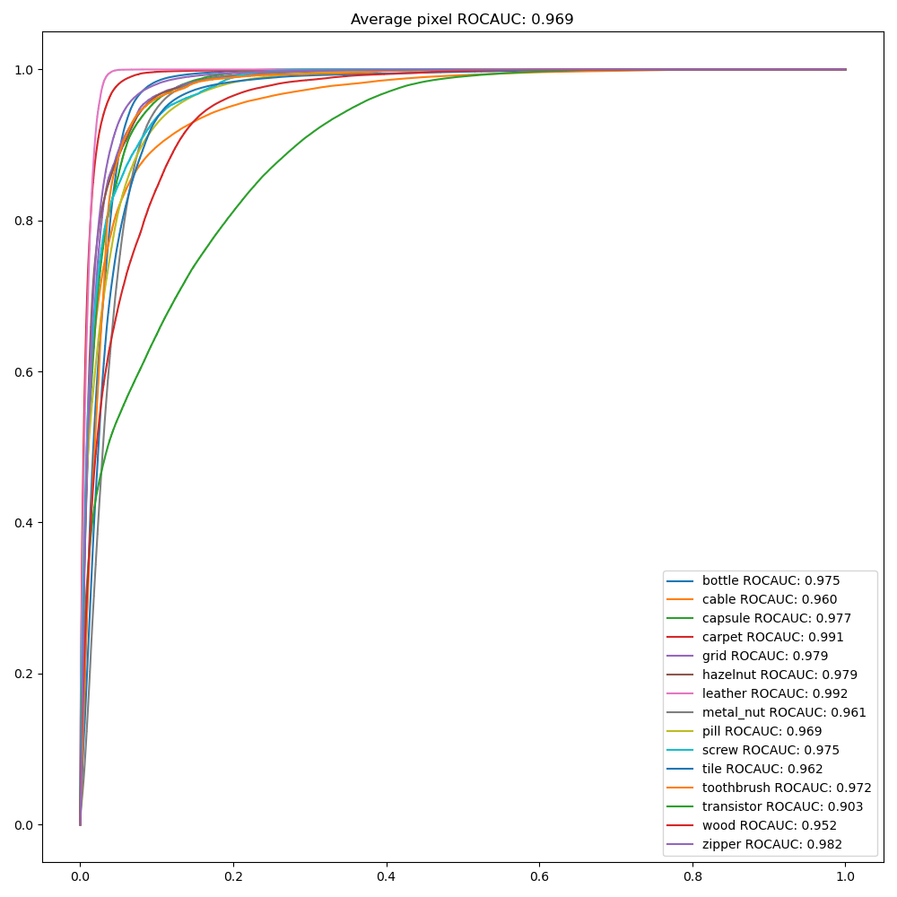

### [Industrial Image Anomaly Localization Based on Gaussian Clustering of Pre-trained Feature](https://ieeexplore.ieee.org/document/9479740)

#### Q. Wan, L. Gao, X. Li and L. Wen, "Industrial Image Anomaly Localization Based on Gaussian Clustering of Pre-trained Feature," in IEEE Transactions on Industrial Electronics, doi: 10.1109/TIE.2021.3094452.

 
 

	

 

 

	
	

 
